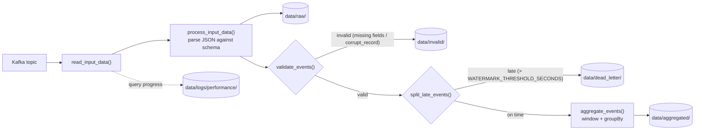

# Streaming Integration

[](https://github.com/jamesoost/steaming-integration/actions/workflows/ci.yml)

A Spark Structured Streaming pipeline that ingests synthetic e-commerce events from Kafka, using common streaming-ingestion patterns: schema validation, an ingestion-time  late-event routing rule and Spark event-time watermarking, a dead-letter path for late events, an invalid-record path for malformed/incomplete data, and windowed aggregation of the remaining valid events. A local Kafka broker and synthetic event producer are included so the pipeline can be run end-to-end without any external infrastructure.

## Architecture
The basic architecture of the implementation is as follows:



`src/stream.py` reads from a Kafka topic and processes each micro-batch through the following stages:

1. **Read** - consume JSON events from the configured Kafka topic.
2. **Parse** - parse the JSON payload against a fixed schema; malformed records are captured via `corrupt_record`. All parsed events are written unfiltered to `data/raw/`.
3. **Validate** - events missing required fields (or with a `corrupt_record`, including unparseable/missing timestamps) are written to `data/invalid/`. Validating before the late-event split ensures malformed records are always caught, since a null `event_timestamp` would otherwise fail to compare as either "on time" or "late".
4. **Split late events** - remaining valid events arriving more than `WATERMARK_THRESHOLD_SECONDS` after their `event_timestamp` are written to `data/dead_letter/`.
5. **Aggregate** - remaining valid, on-time events are windowed (`WINDOW_DURATION`) and grouped by `event`, `category`, `region`, producing `total_value`, `event_count`, and `average_value` in `data/aggregated/`.


Query progress (throughput, lag trend) is logged to `data/logs/performance/`.

## Project structure

- `src/stream.py` - the Structured Streaming pipeline entry point
- `config.py` - environment-variable-driven configuration (Kafka, Spark, pipeline settings)
- `supporting/docker-compose.yml` - local Kafka broker + REST proxy
- `supporting/producer.py` - synthetic event generator, posts to the REST proxy
- `tests/test_stream.py` - unit tests for the pure transformation functions
- `tests/lint.py` - ruff check/format runner
- `data/` - pipeline outputs (`raw/`, `dead_letter/`, `invalid/`, `aggregated/`, `logs/`, `performance/`)

## Requirements

- **Python 3.10+** - matches the version `pyspark==4.2.0` is built/tested against (see `requirements.txt`).
- **Java 17 or 21** - required by `pyspark==4.2.0` Java 25 also works but is deprecated as of Spark 4.2.0 unless ≥ 25.0.3. Set `JAVA_HOME` to a JDK matching one of these versions, or ensure `java` is on your `PATH`.
- **Docker + Docker Compose** - used to run the local Kafka broker and REST proxy defined in `supporting/docker-compose.yml`. No local Kafka install is needed. Note: this repo has been run against the legacy standalone `docker-compose` (hyphenated) binary rather than the newer `docker compose` CLI plugin - check which one you have with `docker-compose --version` / `docker compose version`.
- **Internet access** (or pre-fetched jars) - by default Spark resolves the Kafka connector (`SPARK_KAFKA_PACKAGE` in `config.py`) from Maven Central on startup. For offline/air-gapped runs, download the matching jars ahead of time and set `SPARK_JARS` to their local paths instead.

## Setup

1. Start Kafka and the REST proxy (leaving it running in its own terminal lets you see the stream of data hitting Kafka):
   ```bash
   cd supporting
   docker-compose up
   ```
   > If this requires `sudo`, your user isn't in the `docker` group - run `sudo usermod -aG docker $USER` and restart your shell to avoid needing `sudo` each time.

   > When you're done, stop the containers with `docker-compose down` (run from `supporting/`).
2. Install dependencies:
   ```bash
   pip install -r requirements.txt
   ```
3. Start producing synthetic events:
   ```bash
   python3 supporting/producer.py
   ```
   > ⚠️ `supporting/producer.py` hardcodes `CLUSTER_ID`, which must match the `CLUSTER_ID` set in `supporting/docker-compose.yml`. Verify these match before running the producer. A mismatch will cause requests to the REST proxy to fail.
4. Run the streaming pipeline:
   ```bash
   python3 src/stream.py
   ```

## Configuration

All settings are read from environment variables (see `config.py` for the full list and defaults):

| Variable | Purpose | Default |
|---|---|---|
| `KAFKA_BOOTSTRAP_SERVERS` | Kafka broker address | `localhost:9092` |
| `KAFKA_TOPIC` | Topic to subscribe to | `events` |
| `KAFKA_STARTING_OFFSETS` | Starting offset strategy | `earliest` |
| `KAFKA_MAX_OFFSETS_PER_TRIGGER` | Rate limit per micro-batch | `1000` |
| `SPARK_APP_NAME` | Spark application name | `Streaming Integration` |
| `SPARK_MASTER` | Spark master URL | `local[*]` |
| `SPARK_SHUFFLE_PARTITIONS` | Shuffle partition count | `4` |
| `SPARK_KAFKA_PACKAGE` | Maven coordinate for the Kafka connector | `org.apache.spark:spark-sql-kafka-0-10_2.13:4.2.0` |
| `SPARK_JARS` | Comma-separated local jar paths; overrides `SPARK_KAFKA_PACKAGE` for offline runs | unset |
| `WATERMARK_THRESHOLD_SECONDS` | Late-event cutoff | `30` |
| `WINDOW_DURATION` | Aggregation window size | `1 minute` |
| `KAFKA_FAIL_ON_DATA_LOSS` | Whether to fail the query if Kafka offsets go missing/reset (e.g. topic recreated locally) | `false` |

## Output layout

| Path | Contents |
|---|---|
| `data/raw/` | All parsed events, unfiltered |
| `data/dead_letter/` | Events arriving later than the watermark threshold |
| `data/invalid/` | On-time events missing required fields or with a `corrupt_record` |
| `data/aggregated/` | Windowed aggregates of valid events |
| `data/logs/pipeline/`, `data/logs/performance/` | Pipeline logs and streaming-query performance logs |

## Tests

The repo contains the following test scripts:
test_stream.py - A set of unit tests which cover the pure transformation stages (`process_input_data`, `split_late_events`, `validate_events`, `aggregate_events`) using small in-memory DataFrames, so they run locally without Kafka or Docker. 
lint.py - Runs `ruff check` and `ruff format` for linting and formatting checks.

```bash
pytest tests/test_stream.py
python3 tests/lint.py   # ruff check + format
```

Output from the test suite:

```
============================= test session starts ==============================
platform linux -- Python 3.10.12, pytest-9.1.1, pluggy-1.6.0
collected 5 items

tests/test_stream.py::test_process_input_data_parses_valid_json PASSED   [ 20%]
tests/test_stream.py::test_process_input_data_flags_corrupt_record PASSED [ 40%]
tests/test_stream.py::test_split_late_events PASSED                      [ 60%]
tests/test_stream.py::test_validate_events_splits_valid_and_invalid PASSED [ 80%]
tests/test_stream.py::test_aggregate_events_computes_aggregates PASSED   [100%]

============================== 5 passed in 26.75s ==============================
```

CI runs the same `pytest` and `ruff check` on every push/PR via `.github/workflows/ci.yml`.

## Demo

A real run against the local Kafka broker, from the pipeline's log output:

```
2026-09-16 12:07:23,927 - INFO - Spark session created successfully
2026-09-16 12:07:23,927 - INFO - Reading input data from Kafka topic 'events' at localhost:9092
2026-09-16 12:07:25,173 - INFO - Input data read successfully from Kafka
2026-09-16 12:07:25,896 - INFO - Query started: eaf05210-68d5-44d1-8314-7fc0c907646f, None
2026-09-16 12:07:25,897 - INFO - Raw output data write started
2026-09-16 12:07:26,102 - INFO - Invalid output data write started
2026-09-16 12:07:26,296 - INFO - Dead letter output data write started
2026-09-16 12:07:26,554 - INFO - Aggregated output data write started
```

And from the `performance` log, showing `QueryProgressListener` reporting real throughput per micro-batch:

```
2026-09-16 12:05:10,204 - INFO - Batch ID: 165 | Rows Processed: 159 | Rate of Processing: 28.4/s | Input Rows Per Second: 9.3/s | Batch Process Duration: 5597ms | No lag trend detected: 0.0(current lag: 0.0)
```

Sample output from each pipeline branch (trimmed, real records) is in [`examples/`](examples/):

- [`examples/raw-sample.json`](examples/raw-sample.json) - unfiltered parsed events
- [`examples/invalid-sample.json`](examples/invalid-sample.json) - events missing a required field (`product_id` / `category`)
- [`examples/dead_letter-sample.json`](examples/dead_letter-sample.json) - a late-arriving event (constructed, since the demo producer rarely triggers this path)
- [`examples/aggregated-sample.json`](examples/aggregated-sample.json) - windowed aggregates

## Known limitations

This is a learning/demo project, and some production concerns are intentionally out of scope:

- **No retention/compaction** - `data/raw/`, `data/dead_letter/`, `data/invalid/`, and `data/aggregated/` grow unbounded; nothing archives or deletes old output.
- **Local Kafka has no persistent volume** - recreating the `broker` container (e.g. via `docker-compose down`/`up`) wipes topic data. If Spark's checkpoints in `data/*/​_checkpoint` still reference now-missing offsets, the pipeline will fail unless `KAFKA_FAIL_ON_DATA_LOSS=true`, in which case it logs a warning and continues instead. When switching Kafka instances, it's safest to also clear the relevant `_checkpoint` folders.
- **Four independent streaming queries share one Kafka source** - `raw`, `dead_letter`, `invalid`, and `aggregated` are each separate `writeStream` queries derived from the same parsed stream, so each re-reads from Kafka independently rather than sharing a single read via `foreachBatch`.